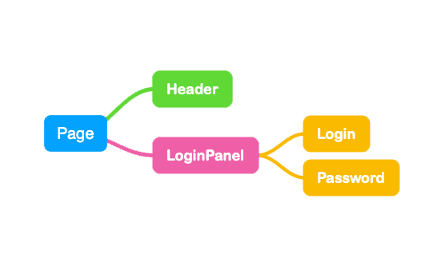

# 交互性设计

至今我们已经学习了如何构造（包装）我们的程序了，但它现在仅仅是动态的，这没有任何意思。
所以说在本大章中，我们会尝试让我们的项目 **动起来** ！

在我们深入学习如何完成交互设计之前，我们先大致了解一下 Dioxus 是如何处理交互的吧。

## 什么是 `State`

每一个应用都会呈现一些内容到UI界面上，Dioxus 框架需要负责就是将这些内容渲染到页面之中。
而作为开发者的你，则需要为框架提供具体的数据内容。

可以动态更新的数据内容在 Dioxus 中则称之为：`State`

如果使用 `dioxus::web::launch_with_props` 运行程序，那么你需要提供一个初始 `State`：

```rust
fn main() {
    // 声明初始化的 State
    let props = PostProps {
        id: Uuid::new_v4(),
        score: 10,
        comment_count: 0,
        post_time: std::time::Instant::now(),
        url: String::from("dioxuslabs.com"),
        title: String::from("Hello, world"),
        original_poster: String::from("dioxus")
    };

    // 启动 Dioxus 程序并传入 props
    dioxus::desktop::launch_with_props(App, props);
}
```

它会向 `App` 传递一个 **不可变** 的 `PostProps`，你也可以将它继续向下级组件传递：

```rust
fn App(cx: Scope<PostProps>) -> Element {
    cx.render(rsx!{
        Title { title: &cx.props.title }
        Score { score: &cx.props.score }
        // etc
    })
}
```

Dioxus 对于 State 的设计遵循了：`单向数据流` 。
当你的组件创建了子组件时，程序的结构最终会形成一个 “树” ，其中状态从 “根” 组件向下传递到树的 “叶” 。



在 Dioxus 中， State 总是从父组件流向子组件。

## 如何更新 `State`

接下来我们需要了解如何对 `State` 数据进行更新。
Dioxus 提供了好几种方法使得 `State` 能在运行时被更新。
对于上面的 Demo 中定义的 `Root State`，我们可以直接使用：`update_root_props` 方法来更新。
但是它会在只更新了其中一小部分文本和属性的情况下刷新我们整个应用程序的渲染树。（这往往都不是我们想要的）

所以说在此时，我们需要用到一个叫 `Hook 钩子` 的东西，它会在你的组件内部存放数据，并使得这些数据 “从上往下” 的 “流动” 到子组件中。
Hook 是一系列特殊的函数，它在组件的内存中保留一个状态槽，并提供一些功能来更新该状态。

我们最常用的 `Hook` 便是函数 `use_state` ，它允许你存放数据到内部，并支持你对数据的更新编辑。

```rust
fn App(cx: Scope)-> Element {

    let post = use_state(&cx, || {
        PostData {
            id: Uuid::new_v4(),
            score: 10,
            comment_count: 0,
            post_time: std::time::Instant::now(),
            url: String::from("dioxuslabs.com"),
            title: String::from("Hello, world"),
            original_poster: String::from("dioxus")
        }        
    });

    cx.render(rsx!{
        Title { title: &post.title }
        Score { score: &post.score }
        // etc
    })   
}
```

我们可以通过 `set` 方法直接更新它的值：

```rust
post.set( PostData {
    id: Uuid::new_v4(),
    score: 20,
    comment_count: 0,
    post_time: std::time::Instant::now(),
    url: String::from("google.com"),
    title: String::from("goodbye, world"),
    original_poster: String::from("google")
});
```

## 何时更新 State

有几种不同的情况下你可以更新状态：你可以在响应用户操作时更新，或在一些后台异步操作被完成后。

### 监听事件

我们可以在响应用户操作时更新数据，也就是在监听器中实现更新代码。

比如说我们希望在按钮被按下后随机生成一篇文章：

```rust
fn App(cx: Scope)-> Element {
    let post = use_state(&cx, || PostData::new());

    cx.render(rsx!{
        button {
            on_click: move |_| post.set(PostData::random())
            "Generate a random post"
        }
        Post { props: &post }
    })   
}
```

这样当按钮 `onclick` 触发后，会对 `post` 进行更新。


### 异步任务

我们也可以在一个协程的执行程序内部进行数据更新，协程就是一个定义的异步代码块。
它能够与组件中的值、钩子和其他数据干净地交互。
由于协程其中的数据必须在 'static 生命周期有效。
所以我们必须显式地声明我们的任务将依赖哪些值，以避免在 React 中常见的道具过时问题。

我们可以在组件中使用任务来构建一个计时的微型秒表。

```rust
fn App(cx: Scope)-> Element {
    let mut sec_elapsed = use_state(&cx, || 0);

    use_future(&cx, || {
        let mut sec_elapsed = sec_elapsed.for_async();
        async move {
            loop {
                TimeoutFuture::from_ms(1000).await;
                sec_elapsed += 1;
            }
        }
    });

    rsx!(cx, div { "Current stopwatch time: {sec_elapsed}" })
}
```

使用异步代码可能很麻烦！后续我们有一整个章节是关于如何在 Dioxus 应用程序中正确使用异步的。